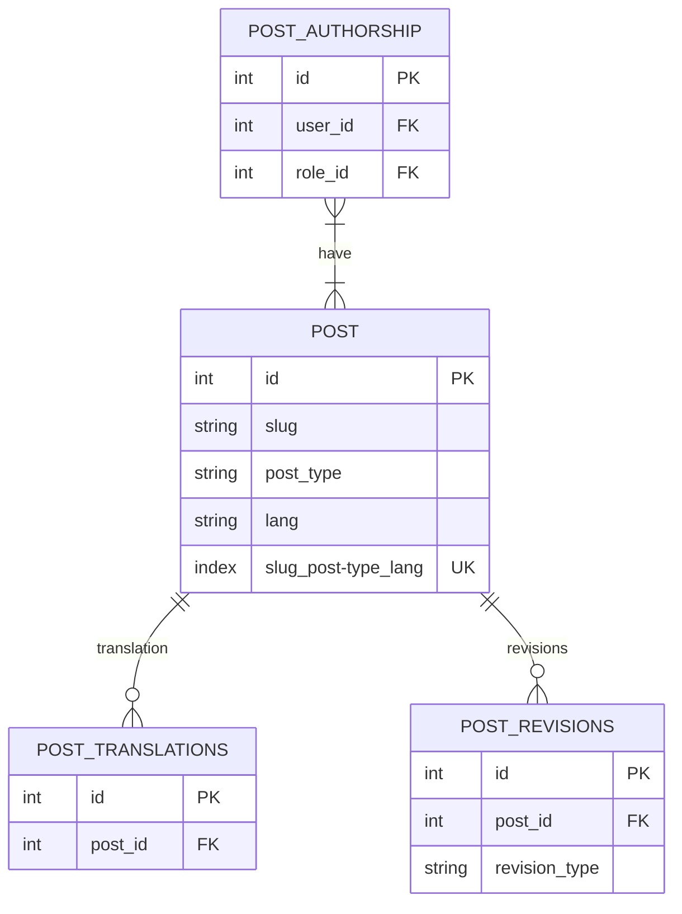
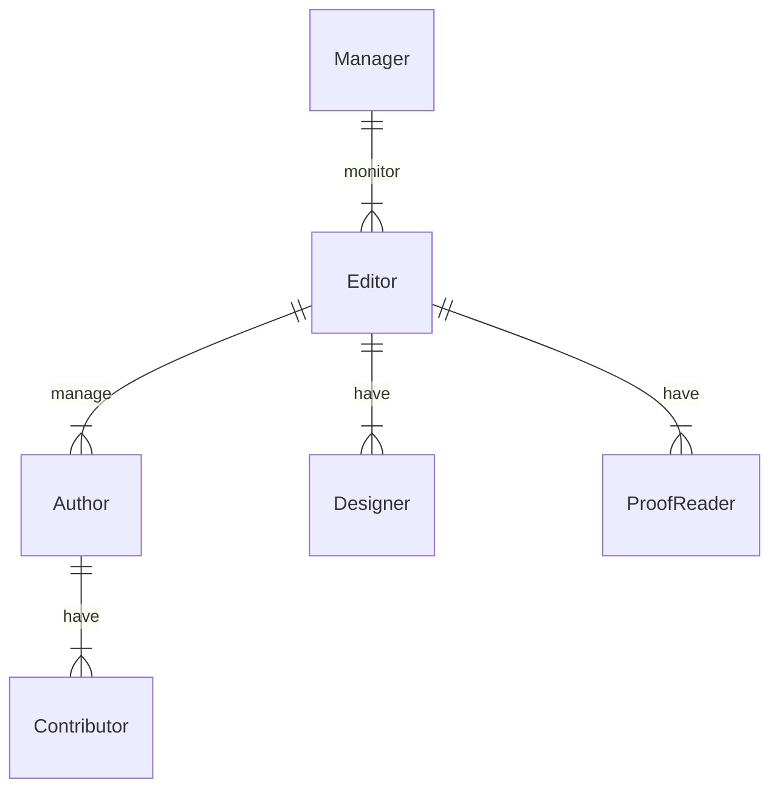
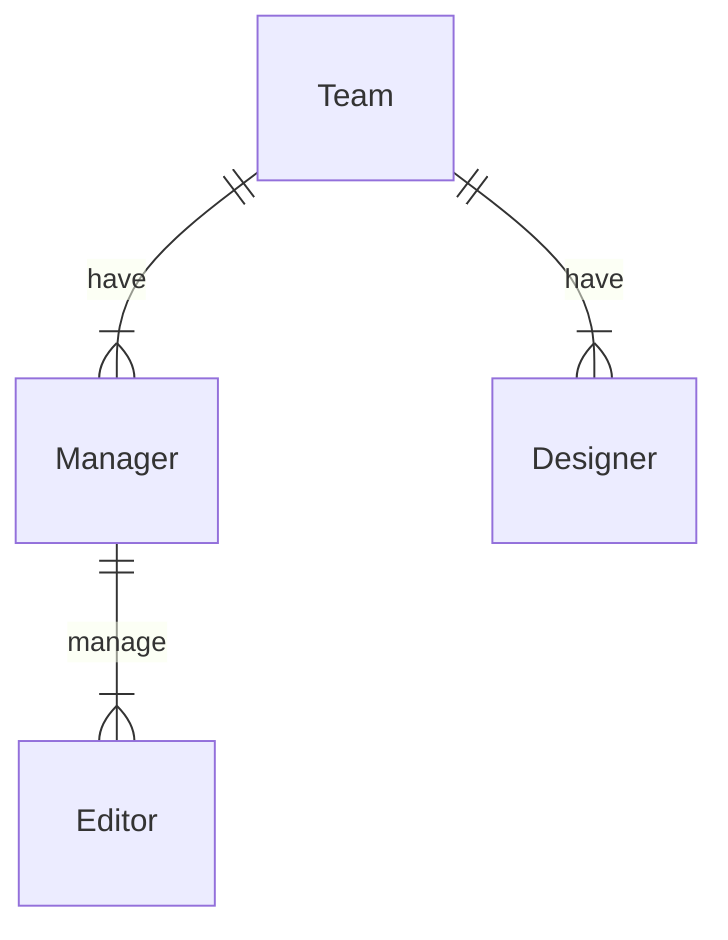
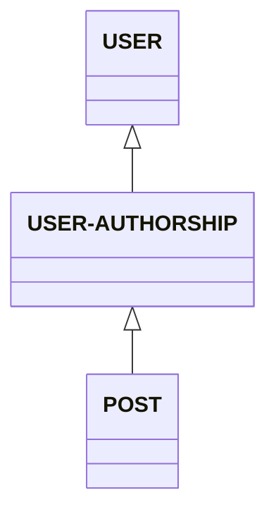

# Post Management

## Features
- Title and slug
- SEO On-Page friendly

  - draft : CRUD by Author, Read only by Editor/Manager. Author submit to "Review"
  - review : R by acan be edited by Editor
  - schedule : has been approved by Editor / Manager and will be publihed on schedule
  - publish : currently on publish
- Save as Revisions, include auto save for n-last saved
- Schedule to Publish
- Authorship and Approval management for approval, can only be applied to Content Manager
  - Manager : manage all content, assign authorship teams
  - Editor : can edit team content, can approve to release
  - Author : creator or owner of the content
  - Contributor : can edit the content, cannot approve such content
  
**Post Status**

| status   | contributor | author | editor | manager |
| -------- | ----------- | ------ | ------ | ------- |
| draft    | U           | CRUD   | R      | R       |
| review   | R           | R      | RU     | R       |
| schedule | R           | R      | R      | R       |
| publish  | R           | R      | R      | R       |
| archive  | R           | R      | R      | R       |

**Permission**
| status           | contributor | author | editor | manager |
| ---------------- | ----------- | ------ | ------ | ------- |
| view             | U           | CRUD   | R      | R       |
| view_any         | R           | R      | RU     | R       |
| create           | R           | R      | R      | R       |
| update           | R           | R      | R      | R       |
| delete           | R           | R      | R      | R       |
| delete_any       | R           | R      | R      | R       |
| force_delete     | R           | R      | R      | R       |
| force_delete_any | R           | R      | R      | R       |
| update_media     | R           | R      | R      | R       |
| review           | R           | R      | R      | R       |
| schedule         | R           | R      | R      | R       |
| publish          | R           | R      | R      | R       |

## Diagram

### Entity Relationship Diagram
User has many authorship, such as as author, editor, manager
User can have many post and page which belongs to authorship

### Authorship Type

### Authorship Team

### Class Diagram

## Next Plan
- Filament Livewire Test for User View, User Create, User Edit, User Export, User Import