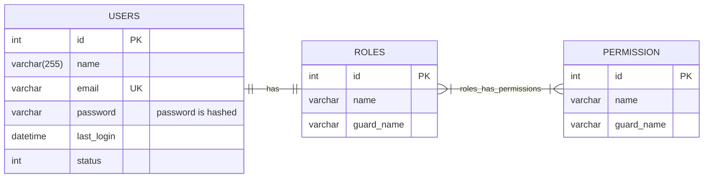

# User Management

## Features
- Password at least mixedcase,  1 numeric, min 8 char, defined in \App\Rules\PasswordRule.php
- Super Admin can be generated via migration while providing .env
    ```env
    # WEBCMS SPECIFICS BELOW
    # - ADMIN PANEL
    ADMIN_NAME=
    ADMIN_EMAIL=
    ADMIN_PASSWORD=
    ```
- User Profile Page with TOTP Can Be Enabled (Optionally) by every user : (https://filamentphp.com/plugins/jeffgreco-breezy)[https://filamentphp.com/plugins/jeffgreco-breezy]
  User Roles Management via Filament Shield : [https://filamentphp.com/plugins/bezhansalleh-shield](https://filamentphp.com/plugins/bezhansalleh-shield) 
- User Role :
  - Super Admin : all features
  - Admin : Web Manger for non-technical purposes 
  - Content Manager : to manage content such as Page, Post, etc
  - Content Observer : can only view the content  
- Export and Import to User CSV using Filament Export / Import Action (via jobs)


## Diagram

### Entity Relationship Diagram
User has one role, where each role has many permission


## Next Plan
- Filament Livewire Test for User View, User Create, User Edit, User Export, User Import